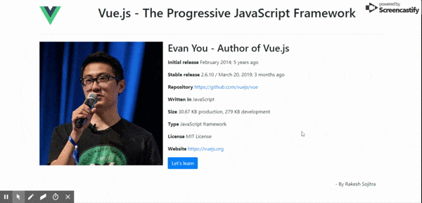

# vuebasics

## Project setup
```
npm install
```

### Compiles and hot-reloads for development
```
npm run serve
```

### Compiles and minifies for production
```
npm run build
```

### Lints and fixes files
```
npm run lint
```

## Demo look

<a href="https://vuestart.netlify.app/" target="_blank">https://vuestart.netlify.app/</a>


